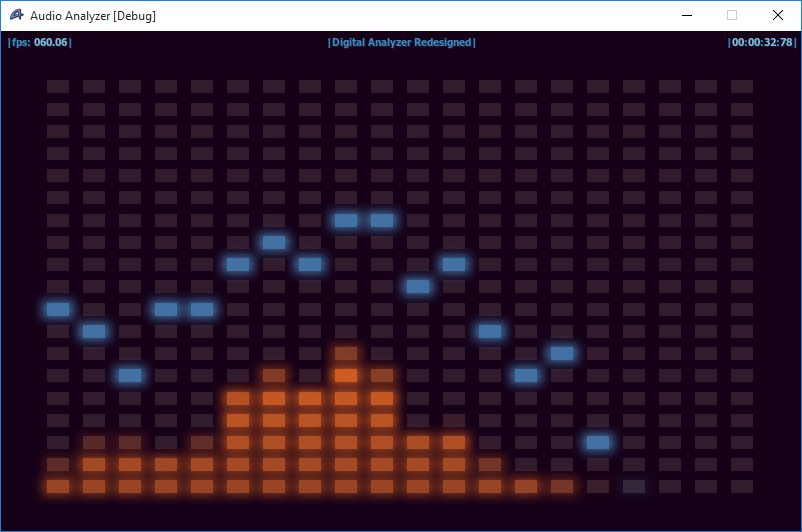

# Audio Analyzer

This is a very old project of mine (started working on it while I was in highschool). The app captures audio data from a Direct Sound Capture source, does fft on it plus some postprocessing and then draws it using my 2D rendering engine backed by Direct3D.

Still works on Windows 10 in 64-bit mode using D3D9 :)

